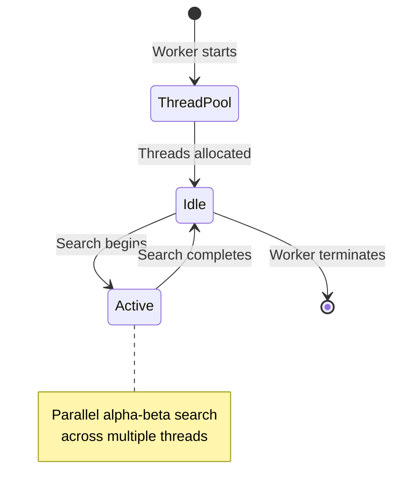

# Multi-Threading and WebAssembly Implementation

## Overview

Metric Chess implements multi-threading through Emscripten-compiled WebAssembly (WASM) using pthreads, enabling parallel chess analysis while maintaining UI responsiveness. This document details the threading architecture, WASM compilation, and performance optimizations.

## Emscripten Pthreads Architecture

### What are Pthreads in WASM?

Emscripten pthreads bring POSIX threads to WebAssembly, allowing C++ code to use `std::thread`, mutexes, and other threading primitives. The resulting WASM module can spawn worker threads for parallel computation.

### Key Components

1. **Main WASM Thread**: Runs in the web worker, manages UCI communication
2. **Pthread Workers**: Generated by Emscripten, handle parallel search
3. **Shared Memory**: SharedArrayBuffer enables cross-thread communication
4. **Thread Pool**: Managed automatically by Emscripten runtime

## Fairy-Stockfish WASM Build

### Build Configuration

The Fairy-Stockfish engine is compiled with specific flags for web deployment:

```makefile
# From temp_fairy/src/Makefile_js
build-stockfish:
    emcc $(EMCC_FLAGS) \
        -pthread \
        -s USE_PTHREADS=1 \
        -s PTHREAD_POOL_SIZE=8 \
        -s SHARED_MEMORY=1 \
        --preload-file $(EVALFILE) \
        -o ../tests/js/stockfish.js
```

### Emscripten Flags Explained

- **`-pthread`**: Enable POSIX threads support
- **`-s USE_PTHREADS=1`**: Activate pthreads in Emscripten
- **`-s PTHREAD_POOL_SIZE=8`**: Pre-allocate thread pool (can be dynamic)
- **`-s SHARED_MEMORY=1`**: Enable SharedArrayBuffer usage
- **`--preload-file`**: Embed NNUE evaluation files in virtual filesystem

## Thread Management

### Dynamic Thread Allocation

The worker automatically configures threads based on system capabilities:

```javascript
// From metric-stockfish-worker.js
const hasSharedArrayBuffer = typeof SharedArrayBuffer !== 'undefined';
const cpuCores = navigator.hardwareConcurrency || 2;
const targetThreads = Math.max(1, Math.floor(cpuCores * 0.75));
const threads = hasSharedArrayBuffer ? Math.min(targetThreads, 8) : 1;

sendEngineCommand(`setoption name Threads value ${threads}`);
```

**Logic:**

- Detect SharedArrayBuffer support (required for pthreads)
- Use 75% of available CPU cores
- Cap at 8 threads to prevent system overload
- Fallback to 1 thread if SharedArrayBuffer unavailable

### Thread Lifecycle



## SharedArrayBuffer Requirements

### Browser Support

SharedArrayBuffer requires Cross-Origin-Opener-Policy (COOP) and Cross-Origin-Embedder-Policy (COEP) headers:

```javascript
// vite.config.js
export default {
    server: {
        headers: {
            'Cross-Origin-Opener-Policy': 'same-origin',
            'Cross-Origin-Embedder-Policy': 'require-corp'
        }
    }
}
```

### Why These Headers?

- **COOP**: Prevents window from being opened by other origins
- **COEP**: Requires CORP headers on cross-origin resources
- **Security**: Prevents Spectre-style attacks on shared memory

### Development vs Production

```javascript
// Development: Vite handles headers automatically
// Production: Must be configured on server
server {
    add_header Cross-Origin-Opener-Policy same-origin;
    add_header Cross-Origin-Embedder-Policy require-corp;
}
```

## WASM Module Loading

### Module Configuration

The worker configures the Emscripten module before loading:

```javascript
const moduleConfig = {
    mainScriptUrlOrBlob: stockfishScriptPath,
    locateFile: function(path) {
        if (path.endsWith('.wasm')) {
            return stockfishBasePath + 'stockfish.wasm';
        }
        if (path.endsWith('.worker.js')) {
            return stockfishBasePath + 'stockfish.worker.js';
        }
        return stockfishBasePath + path;
    }
};

engine = await Stockfish(moduleConfig);
```

### File Location Resolution

- **`mainScriptUrlOrBlob`**: Tells pthreads where to find the main script
- **`locateFile`**: Maps WASM and worker files to correct URLs
- **Path Handling**: Supports both development (`/js/stockfish/`) and production (`/stockfish/`) paths

## NNUE Evaluation

### Neural Network Integration

Fairy-Stockfish uses NNUE (Neural Network UCI Engine) for position evaluation:

```javascript
// Enable NNUE in worker
sendEngineCommand('setoption name Use NNUE value true');
sendEngineCommand('setoption name EvalFile value nn-62ef826d1a6d.nnue');
```

### NNUE Architecture

- **Input**: Chess position features (768 neurons)
- **Hidden Layer**: 256 neurons with clipped ReLU activation
- **Output**: Position evaluation score
- **Training**: Based on millions of positions from high-level games

### Performance Benefits

- **Speed**: 100-1000x faster than traditional evaluation
- **Accuracy**: Superior positional understanding
- **Threading**: NNUE evaluation is thread-safe and parallelizable

## Memory Management

### WASM Memory Layout

```diagram
+------------------+ 0x00000000
| Static Data      |
+------------------+
| Stack            |
+------------------+
| Heap             |
+------------------+
| Shared Memory    | (for pthreads)
+------------------+
```

### Memory Configuration

```javascript
// Emscripten memory settings
-s TOTAL_MEMORY=256MB      // Base memory allocation
-s ALLOW_MEMORY_GROWTH=1   // Allow dynamic growth
-s SHARED_MEMORY=1         // Enable shared memory
```

### Thread Stack Size

Each pthread gets its own stack:

- **Default**: 2MB per thread
- **Configurable**: `-s PTHREAD_STACK_SIZE=2097152`
- **Total Memory**: Base + (Stack Size × Thread Count)

## Performance Optimization

### Search Parallelization

Fairy-Stockfish uses Lazy SMP (Symmetric Multi-Processing):

```cpp
// Simplified search loop (actual implementation in C++)
void search(Position& pos, int depth) {
    #pragma omp parallel for
    for (int i = 0; i < numThreads; i++) {
        // Each thread searches different move sequences
        alphaBeta(pos, depth, alpha, beta);
    }
}
```

### Hash Table Sharing

- **Shared Transposition Table**: All threads share the same hash table
- **Thread-Safe Access**: Atomic operations prevent race conditions
- **Size Configuration**: `setoption name Hash value 256` (256MB)

### Move Ordering

Threads cooperate on move ordering:

- **History Heuristic**: Shared between threads
- **Killer Moves**: Thread-local but shared statistics
- **PV Moves**: Principal variation moves prioritized

## Debugging Multi-Threaded Code

### Thread-Safe Logging

```javascript
// Worker logging (thread-safe in main thread context)
console.log('Worker: Engine configured with', threads, 'threads');
```

### Performance Monitoring

```javascript
// Monitor thread utilization
const startTime = performance.now();
worker.go(3000, (move) => {
    const duration = performance.now() - startTime;
    console.log(`Search completed in ${duration}ms with ${threads} threads`);
});
```

### Common Issues

1. **SharedArrayBuffer Errors**

   ```txt
   Error: SharedArrayBuffer is not defined
   Solution: Check COOP/COEP headers
   ```

2. **Thread Creation Failures**

   ```txt
   Error: Failed to create thread
   Solution: Reduce thread count or check memory limits
   ```

3. **Deadlocks**

   ```txt
   Symptom: Worker becomes unresponsive
   Solution: Check for improper mutex usage in C++ code
   ```

## Browser Compatibility

### Supported Browsers

- **Chrome/Edge**: Full support with COOP/COEP
- **Firefox**: Full support (version 79+)
- **Safari**: Limited support (version 16.4+)
- **Mobile**: iOS Safari 16.4+, Android Chrome

### Fallback Strategy

```javascript
if (!hasSharedArrayBuffer) {
    console.warn('SharedArrayBuffer not supported, using single-threaded mode');
    sendEngineCommand('setoption name Threads value 1');
}
```

## Future Optimizations

### WebAssembly SIMD

- **Current**: Scalar operations
- **Future**: 128-bit SIMD instructions for evaluation speedup
- **Build Flag**: `-msimd128`

### WebAssembly Threads

- **Current**: Emscripten pthreads
- **Future**: Native WASM threads (proposal stage)
- **Benefits**: Better performance, smaller binary size

### GPU Acceleration

- **WebGPU**: Potential for NNUE evaluation on GPU
- **TensorFlow.js**: Alternative NNUE implementation
- **Performance**: Could provide massive speedup for evaluation

This threading implementation provides desktop-level chess analysis performance in the browser while maintaining responsive user interfaces through careful resource management and fallback strategies.
