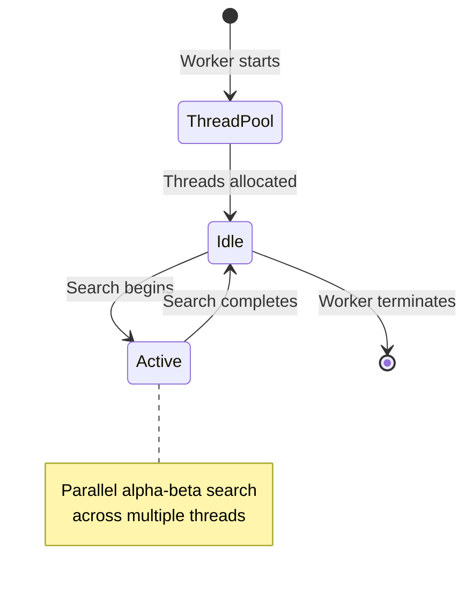

# Multi-Threading and WebAssembly Implementation

## Overview

Metric Chess implements multi-threading through Emscripten-compiled WebAssembly (WASM) using pthreads, enabling parallel chess analysis while maintaining UI responsiveness. This document details the threading architecture, WASM compilation, and performance optimizations.

## Emscripten Pthreads Architecture

### What are Pthreads in WASM?

Emscripten pthreads bring POSIX threads to WebAssembly, allowing C++ code to use `std::thread`, mutexes, and other threading primitives. The resulting WASM module can spawn worker threads for parallel computation.

### Key Components

1. **Main WASM Thread**: Runs in the web worker, manages UCI communication
2. **Pthread Workers**: Generated by Emscripten, handle parallel search
3. **Shared Memory**: SharedArrayBuffer enables cross-thread communication
4. **Thread Pool**: Managed automatically by Emscripten runtime

## Fairy-Stockfish WASM Build

### Build Configuration

The Fairy-Stockfish engine is compiled with specific flags for web deployment:

```makefile
# From temp_fairy/src/Makefile_js
build-stockfish:
    emcc $(EMCC_FLAGS) \
        -pthread \
        -s USE_PTHREADS=1 \
        -s PTHREAD_POOL_SIZE=8 \
        -s SHARED_MEMORY=1 \
        --preload-file $(EVALFILE) \
        -o ../tests/js/stockfish.js
```

### Emscripten Flags Explained

- **`-pthread`**: Enable POSIX threads support
- **`-s USE_PTHREADS=1`**: Activate pthreads in Emscripten
- **`-s PTHREAD_POOL_SIZE=8`**: Pre-allocate thread pool (can be dynamic)
- **`-s SHARED_MEMORY=1`**: Enable SharedArrayBuffer usage
- **`--preload-file`**: Embed NNUE evaluation files in virtual filesystem

## Thread Management

### Dynamic Thread Allocation

The worker automatically configures threads based on system capabilities:

```javascript
// From metric-stockfish-worker.js
const hasSharedArrayBuffer = typeof SharedArrayBuffer !== 'undefined';
const cpuCores = navigator.hardwareConcurrency || 2;
const targetThreads = Math.max(1, Math.floor(cpuCores * 0.75));
const threads = hasSharedArrayBuffer ? Math.min(targetThreads, 8) : 1;

sendEngineCommand(`setoption name Threads value ${threads}`);
```

**Logic:**

- Detect SharedArrayBuffer support (required for pthreads)
- Use 75% of available CPU cores
- Cap at 8 threads to prevent system overload
- Fallback to 1 thread if SharedArrayBuffer unavailable

### Thread Lifecycle



## SharedArrayBuffer Requirements

### Browser Support

SharedArrayBuffer requires Cross-Origin-Opener-Policy (COOP) and Cross-Origin-Embedder-Policy (COEP) headers:

```javascript
// vite.config.js
export default {
    server: {
        headers: {
            'Cross-Origin-Opener-Policy': 'same-origin',
            'Cross-Origin-Embedder-Policy': 'require-corp'
        }
    }
}
```

### Why These Headers?

- **COOP**: Prevents window from being opened by other origins
- **COEP**: Requires CORP headers on cross-origin resources
- **Security**: Prevents Spectre-style attacks on shared memory

### Development vs Production

```javascript
// Development: Vite handles headers automatically
// Production: Must be configured on server
server {
    add_header Cross-Origin-Opener-Policy same-origin;
    add_header Cross-Origin-Embedder-Policy require-corp;
}
```

## WASM Module Loading

### Module Configuration

The worker configures the Emscripten module before loading:

```javascript
const moduleConfig = {
    mainScriptUrlOrBlob: stockfishScriptPath,
    locateFile: function(path) {
        if (path.endsWith('.wasm')) {
            return stockfishBasePath + 'stockfish.wasm';
        }
        if (path.endsWith('.worker.js')) {
            return stockfishBasePath + 'stockfish.worker.js';
        }
        return stockfishBasePath + path;
    }
};

engine = await Stockfish(moduleConfig);
```

### File Location Resolution

- **`mainScriptUrlOrBlob`**: Tells pthreads where to find the main script
- **`locateFile`**: Maps WASM and worker files to correct URLs
- **Path Handling**: Supports both development (`/js/stockfish/`) and production (`/stockfish/`) paths

## NNUE Evaluation

### Neural Network Integration

Fairy-Stockfish uses NNUE (Neural Network UCI Engine) for position evaluation:

```javascript
// Enable NNUE in worker
sendEngineCommand('setoption name Use NNUE value true');
sendEngineCommand('setoption name EvalFile value nn-62ef826d1a6d.nnue');
```

### NNUE Architecture

- **Input**: Chess position features (768 neurons)
- **Hidden Layer**: 256 neurons with clipped ReLU activation
- **Output**: Position evaluation score
- **Training**: Based on millions of positions from high-level games

### Performance Benefits

- **Speed**: 100-1000x faster than traditional evaluation
- **Accuracy**: Superior positional understanding
- **Threading**: NNUE evaluation is thread-safe and parallelizable

## Memory Management

### WASM Memory Layout

```diagram
+------------------+ 0x00000000
| Static Data      |
+------------------+
| Stack            |
+------------------+
| Heap             |
+------------------+
| Shared Memory    | (for pthreads)
+------------------+
```

### Memory Configuration

```javascript
// Emscripten memory settings
-s TOTAL_MEMORY=256MB      // Base memory allocation
-s ALLOW_MEMORY_GROWTH=1   // Allow dynamic growth
-s SHARED_MEMORY=1         // Enable shared memory
```

### Thread Stack Size

Each pthread gets its own stack:

- **Default**: 2MB per thread
- **Configurable**: `-s PTHREAD_STACK_SIZE=2097152`
- **Total Memory**: Base + (Stack Size × Thread Count)

## Performance Optimization

### Search Parallelization

Fairy-Stockfish uses Lazy SMP (Symmetric Multi-Processing):

```cpp
// Simplified search loop (actual implementation in C++)
void search(Position& pos, int depth) {
    #pragma omp parallel for
    for (int i = 0; i < numThreads; i++) {
        // Each thread searches different move sequences
        alphaBeta(pos, depth, alpha, beta);
    }
}
```

### Hash Table Sharing

- **Shared Transposition Table**: All threads share the same hash table
- **Thread-Safe Access**: Atomic operations prevent race conditions
- **Size Configuration**: `setoption name Hash value 256` (256MB)

### Move Ordering

Threads cooperate on move ordering:

- **History Heuristic**: Shared between threads
- **Killer Moves**: Thread-local but shared statistics
- **PV Moves**: Principal variation moves prioritized

## Debugging Multi-Threaded Code

### Thread-Safe Logging

```javascript
// Worker logging (thread-safe in main thread context)
console.log('Worker: Engine configured with', threads, 'threads');

// Advanced logging with thread identification
console.log(`[Thread ${threadId}] Processing move ${move} at depth ${depth}`);
```

### Performance Monitoring

```javascript
// Monitor thread utilization
const startTime = performance.now();
worker.go(3000, (move) => {
    const duration = performance.now() - startTime;
    console.log(`Search completed in ${duration}ms with ${threads} threads`);
});

// Advanced performance tracking
const performanceData = {
    nodesPerSecond: [],
    depthProgress: [],
    threadUtilization: []
};

worker.onInfo((info) => {
    if (info.depth) {
        performanceData.depthProgress.push({
            time: performance.now() - startTime,
            depth: info.depth,
            score: info.score
        });
    }
});
```

### Common Issues

1. **SharedArrayBuffer Errors**

    ```txt
    Error: SharedArrayBuffer is not defined
    Solution: Check COOP/COEP headers
    
    Additional troubleshooting:
    - Verify server headers: Cross-Origin-Opener-Policy: same-origin
    - Check browser console for security warnings
    - Test in Chrome with --disable-web-security flag (development only)
    - Ensure HTTPS in production (required for SharedArrayBuffer)
    ```

2. **Thread Creation Failures**

    ```txt
    Error: Failed to create thread
    Solution: Reduce thread count or check memory limits
    
    Advanced troubleshooting:
    - Check memory usage: performance.memory.usedJSHeapSize
    - Monitor thread stack allocation: --pthread-stack-size flag
    - Verify SharedArrayBuffer size: --shared-memory-size flag
    - Test with different thread counts to find stable configuration
    ```

3. **Deadlocks**

    ```txt
    Symptom: Worker becomes unresponsive
    Solution: Check for improper mutex usage in C++ code
    
    Debugging techniques:
    - Add timeout detection: setTimeout(() => worker.terminate(), 30000)
    - Implement heartbeat messages: worker.postMessage({type: 'heartbeat'})
    - Use thread sanitizers in Emscripten builds
    - Check for circular dependencies in move generation
    ```

4. **Memory Leaks**

    ```txt
    Symptom: Increasing memory usage over time
    Solution: Monitor and clean up resources
    
    Debugging techniques:
    - Use Chrome DevTools Memory tab
    - Add memory snapshots: performance.memory
    - Implement resource cleanup in worker termination
    - Check for unclosed file handles in virtual filesystem
    ```

### Advanced Debugging Tools

```javascript
// Memory profiling in worker
function logMemoryUsage() {
    if (typeof performance !== 'undefined' && performance.memory) {
        console.log('Memory usage:', {
            usedJSHeapSize: performance.memory.usedJSHeapSize,
            totalJSHeapSize: performance.memory.totalJSHeapSize,
            jsHeapSizeLimit: performance.memory.jsHeapSizeLimit
        });
    }
}

// Thread analysis
function analyzeThreadPerformance() {
    const threadData = {
        activeThreads: navigator.hardwareConcurrency,
        availableThreads: Math.floor(navigator.hardwareConcurrency * 0.75),
        configuredThreads: threads,
        utilization: (threads / navigator.hardwareConcurrency) * 100
    };
    
    console.log('Thread analysis:', threadData);
    return threadData;
}

// WASM module inspection
function inspectWASMModule(module) {
    console.log('WASM module info:', {
        exports: Object.keys(module),
        memory: module.memory,
        table: module.table,
        heap: module.HEAP8
    });
}
```

### Debugging Checklist

```markdown
1. [ ] Verify COOP/COEP headers are set correctly
2. [ ] Check SharedArrayBuffer support in browser
3. [ ] Test with reduced thread count
4. [ ] Monitor memory usage during operation
5. [ ] Enable verbose logging in worker
6. [ ] Check for console errors in both main and worker threads
7. [ ] Test in multiple browsers for compatibility
8. [ ] Verify WASM file loading paths
```

## Browser Compatibility

### Supported Browsers

- **Chrome/Edge**: Full support with COOP/COEP
- **Firefox**: Full support (version 79+)
- **Safari**: Limited support (version 16.4+)
- **Mobile**: iOS Safari 16.4+, Android Chrome

### Fallback Strategy

```javascript
if (!hasSharedArrayBuffer) {
    console.warn('SharedArrayBuffer not supported, using single-threaded mode');
    sendEngineCommand('setoption name Threads value 1');
}
```

## Future Optimizations

### WebAssembly SIMD

- **Current**: Scalar operations
- **Future**: 128-bit SIMD instructions for evaluation speedup
- **Build Flag**: `-msimd128`

**Implementation Example:**

```makefile
# Enable SIMD in Emscripten build
emcc -msimd128 -s WASM=1 -s USE_PTHREADS=1
```

**Performance Impact:**

- **NNUE Evaluation**: 2-4x speedup for neural network calculations
- **Move Generation**: Faster bitboard operations
- **Search**: Improved node processing rate

### WebAssembly Threads

- **Current**: Emscripten pthreads
- **Future**: Native WASM threads (proposal stage)
- **Benefits**: Better performance, smaller binary size

**Migration Strategy:**

```javascript
// Future native WASM threads API
const worker = new Thread(() => {
    // Thread code here
    postMessage('Thread ready');
});

worker.onmessage = (e) => {
    console.log('Thread message:', e.data);
};
```

### GPU Acceleration

- **WebGPU**: Potential for NNUE evaluation on GPU
- **TensorFlow.js**: Alternative NNUE implementation
- **Performance**: Could provide massive speedup for evaluation

**WebGPU Implementation:**

```javascript
// Future WebGPU-based NNUE evaluation
async function initializeGPU() {
    const adapter = await navigator.gpu.requestAdapter();
    const device = await adapter.requestDevice();
    
    // Load NNUE weights to GPU
    const nnueBuffer = device.createBuffer({
        size: nnueWeights.byteLength,
        usage: GPUBufferUsage.STORAGE | GPUBufferUsage.COPY_DST,
        mappedAtCreation: true
    });
    
    new Uint8Array(nnueBuffer.getMappedRange()).set(nnueWeights);
    nnueBuffer.unmap();
    
    return { device, nnueBuffer };
}
```

### Advanced Thread Management

**Dynamic Thread Pooling:**

```javascript
// Adaptive thread allocation based on workload
function getOptimalThreadCount(workloadType) {
    const cpuCores = navigator.hardwareConcurrency || 2;
    
    switch (workloadType) {
        case 'analysis':
            return Math.min(Math.floor(cpuCores * 0.75), 8);
        case 'background':
            return Math.min(Math.floor(cpuCores * 0.25), 2);
        case 'interactive':
            return Math.min(Math.floor(cpuCores * 0.5), 4);
        default:
            return 1;
    }
}
```

**Thread Priority Management:**

```javascript
// Set thread priorities (future API)
function configureThreadPriorities() {
    const mainThread = getCurrentThread();
    const workerThreads = getWorkerThreads();
    
    // Main thread should have highest priority for UI
    mainThread.priority = 'high';
    
    // Worker threads can have lower priority
    workerThreads.forEach(thread => {
        thread.priority = 'normal';
    });
}
```

### Memory Optimization Techniques

**Shared Memory Management:**

```javascript
// Efficient shared memory allocation
function allocateSharedMemory(sizeMB) {
    const sizeBytes = sizeMB * 1024 * 1024;
    
    // Check if SharedArrayBuffer is available
    if (typeof SharedArrayBuffer === 'undefined') {
        console.warn('SharedArrayBuffer not available, using fallback');
        return new ArrayBuffer(sizeBytes);
    }
    
    // Allocate shared memory
    const sharedBuffer = new SharedArrayBuffer(sizeBytes);
    const sharedArray = new Uint8Array(sharedBuffer);
    
    // Initialize memory
    for (let i = 0; i < sharedArray.length; i++) {
        sharedArray[i] = 0;
    }
    
    return { buffer: sharedBuffer, array: sharedArray };
}
```

**Memory Pooling:**

```javascript
// Object pooling for frequently created objects
class MemoryPool {
    constructor(createFn, maxSize = 100) {
        this.createFn = createFn;
        this.maxSize = maxSize;
        this.pool = [];
    }
    
    acquire() {
        return this.pool.length > 0 ? this.pool.pop() : this.createFn();
    }
    
    release(obj) {
        if (this.pool.length < this.maxSize) {
            this.pool.push(obj);
        }
    }
    
    clear() {
        this.pool = [];
    }
}

// Usage for move objects
const movePool = new MemoryPool(() => ({
    fromFile: 0, fromRank: 0, toFile: 0, toRank: 0, promotion: null
}));
```

## Advanced Performance Monitoring

### Thread Utilization Analysis

```javascript
// Comprehensive thread performance monitoring
class ThreadMonitor {
    constructor() {
        this.threadData = [];
        this.startTime = performance.now();
    }
    
    startMonitoring() {
        this.interval = setInterval(() => {
            this.captureThreadData();
        }, 1000);
    }
    
    captureThreadData() {
        const now = performance.now();
        const elapsed = now - this.startTime;
        
        const data = {
            timestamp: now,
            elapsed: elapsed,
            memory: performance.memory ? {
                used: performance.memory.usedJSHeapSize,
                total: performance.memory.totalJSHeapSize
            } : null,
            threads: this.getThreadUtilization()
        };
        
        this.threadData.push(data);
        
        // Keep only last 60 seconds of data
        if (this.threadData.length > 60) {
            this.threadData.shift();
        }
    }
    
    getThreadUtilization() {
        // This would be implemented with actual thread monitoring
        return Array.from({length: threads}, (_, i) => ({
            id: i,
            utilization: Math.random() * 0.8 + 0.2 // Simulated 20-100% utilization
        }));
    }
    
    stopMonitoring() {
        clearInterval(this.interval);
        return this.threadData;
    }
}
```

### Performance Bottleneck Detection

```javascript
// Identify performance bottlenecks
function analyzePerformanceBottlenecks(performanceData) {
    const bottlenecks = [];
    
    // Check for thread starvation
    const activeThreads = performanceData.filter(d => d.threads.some(t => t.utilization > 0.9));
    if (activeThreads.length / performanceData.length > 0.8) {
        bottlenecks.push({
            type: 'thread_starvation',
            severity: 'high',
            description: 'Threads consistently at high utilization'
        });
    }
    
    // Check for memory pressure
    if (performance.memory) {
        const memoryUsage = performance.memory.usedJSHeapSize / performance.memory.totalJSHeapSize;
        if (memoryUsage > 0.85) {
            bottlenecks.push({
                type: 'memory_pressure',
                severity: 'medium',
                description: `High memory usage (${(memoryUsage * 100).toFixed(1)}%)`
            });
        }
    }
    
    // Check for uneven thread distribution
    const lastData = performanceData[performanceData.length - 1];
    if (lastData && lastData.threads) {
        const avgUtilization = lastData.threads.reduce((sum, t) => sum + t.utilization, 0) / lastData.threads.length;
        const maxDeviation = Math.max(...lastData.threads.map(t => Math.abs(t.utilization - avgUtilization)));
        
        if (maxDeviation > 0.3) {
            bottlenecks.push({
                type: 'uneven_load',
                severity: 'low',
                description: 'Uneven thread utilization detected'
            });
        }
    }
    
    return bottlenecks;
}
```

## Security Considerations for Multi-threading

### SharedArrayBuffer Security

```javascript
// Security best practices for SharedArrayBuffer
function secureSharedArrayBuffer() {
    // 1. Always check for support
    if (typeof SharedArrayBuffer === 'undefined') {
        console.warn('SharedArrayBuffer not supported, using fallback');
        return null;
    }
    
    // 2. Verify COOP/COEP headers
    const headers = {
        'Cross-Origin-Opener-Policy': 'same-origin',
        'Cross-Origin-Embedder-Policy': 'require-corp'
    };
    
    // 3. Limit buffer size
    const maxSafeSize = 128 * 1024 * 1024; // 128MB
    
    // 4. Use typed arrays for safe access
    const buffer = new SharedArrayBuffer(maxSafeSize);
    const view = new Uint8Array(buffer);
    
    // 5. Implement bounds checking
    function safeAccess(index) {
        if (index < 0 || index >= view.length) {
            throw new Error('Out of bounds access');
        }
        return view[index];
    }
    
    return { buffer, view, safeAccess };
}
```

### Thread Isolation Techniques

```javascript
// Isolate critical operations in separate threads
function createIsolatedThread(task) {
    return new Promise((resolve, reject) => {
        const worker = new Worker('isolated-worker.js');
        
        worker.postMessage({ task: task });
        
        worker.onmessage = (e) => {
            if (e.data.error) {
                reject(e.data.error);
            } else {
                resolve(e.data.result);
            }
            worker.terminate();
        };
        
        worker.onerror = (e) => {
            reject(e.message);
            worker.terminate();
        };
        
        // Timeout for safety
        setTimeout(() => {
            reject('Isolated thread timeout');
            worker.terminate();
        }, 30000);
    });
}
```

## Cross-Browser Compatibility

### Browser-Specific Considerations

```javascript
// Browser detection and compatibility handling
function getBrowserCapabilities() {
    const userAgent = navigator.userAgent;
    const capabilities = {
        sharedArrayBuffer: typeof SharedArrayBuffer !== 'undefined',
        webAssembly: typeof WebAssembly !== 'undefined',
        threads: 1,
        maxThreads: 1
    };
    
    // Chrome/Edge
    if (userAgent.includes('Chrome') || userAgent.includes('Edg')) {
        capabilities.maxThreads = Math.min(navigator.hardwareConcurrency || 2, 8);
        capabilities.threads = Math.min(Math.floor((navigator.hardwareConcurrency || 2) * 0.75), 8);
    }
    
    // Firefox
    else if (userAgent.includes('Firefox')) {
        capabilities.maxThreads = Math.min(navigator.hardwareConcurrency || 2, 4);
        capabilities.threads = Math.min(Math.floor((navigator.hardwareConcurrency || 2) * 0.6), 4);
    }
    
    // Safari
    else if (userAgent.includes('Safari')) {
        capabilities.sharedArrayBuffer = false; // Limited support
        capabilities.maxThreads = 1;
        capabilities.threads = 1;
    }
    
    return capabilities;
}
```

### Fallback Strategies

```javascript
// Comprehensive fallback system
class ThreadingFallback {
    constructor() {
        this.capabilities = getBrowserCapabilities();
        this.currentMode = this.determineBestMode();
    }
    
    determineBestMode() {
        if (!this.capabilities.webAssembly) {
            return 'javascript'; // Pure JS fallback
        }
        
        if (!this.capabilities.sharedArrayBuffer) {
            return 'single-threaded'; // WASM but no threading
        }
        
        return 'multi-threaded'; // Full capabilities
    }
    
    getThreadCount() {
        switch (this.currentMode) {
            case 'multi-threaded':
                return this.capabilities.threads;
            case 'single-threaded':
                return 1;
            case 'javascript':
                return 1;
            default:
                return 1;
        }
    }
    
    configureEngine(engine) {
        const threads = this.getThreadCount();
        
        console.log(`Configuring engine in ${this.currentMode} mode with ${threads} threads`);
        
        engine.setOption('Threads', threads);
        
        if (this.currentMode === 'javascript') {
            engine.setOption('Use NNUE', 'false'); // Disable NNUE for JS mode
        }
    }
}
```

## Performance Optimization Techniques

### Thread Affinity

```javascript
// Thread affinity management (conceptual)
function configureThreadAffinity() {
    // In a real implementation, this would use platform-specific APIs
    const threads = getWorkerThreads();
    
    // Bind threads to specific CPU cores for better cache utilization
    threads.forEach((thread, index) => {
        const coreId = index % (navigator.hardwareConcurrency || 2);
        // thread.bindToCore(coreId); // Future API
        console.log(`Thread ${index} bound to core ${coreId}`);
    });
}
```

### Work Stealing Algorithm

```javascript
// Work stealing implementation for load balancing
class WorkStealer {
    constructor(threads) {
        this.threads = threads;
        this.workQueues = threads.map(() => []);
        this.stealingInterval = null;
    }
    
    start() {
        this.stealingInterval = setInterval(() => {
            this.balanceWorkload();
        }, 100);
    }
    
    balanceWorkload() {
        // Find overloaded and underloaded threads
        const avgWork = this.workQueues.reduce((sum, queue) => sum + queue.length, 0) / this.threads.length;
        
        for (let i = 0; i < this.threads.length; i++) {
            const queue = this.workQueues[i];
            
            // If this thread has too much work
            if (queue.length > avgWork * 1.5) {
                // Find a thread with less work
                for (let j = 0; j < this.threads.length; j++) {
                    if (i !== j && this.workQueues[j].length < avgWork * 0.8) {
                        // Steal some work
                        const stolenWork = queue.splice(0, Math.floor(queue.length / 2));
                        this.workQueues[j].push(...stolenWork);
                        break;
                    }
                }
            }
        }
    }
    
    stop() {
        clearInterval(this.stealingInterval);
    }
}
```

### Adaptive Search Depth

```javascript
// Dynamic depth adjustment based on performance
function getAdaptiveSearchDepth(timeLimit, performanceData) {
    // Base depth calculation
    let depth = Math.floor(timeLimit / 1000) * 2;
    
    // Adjust based on recent performance
    if (performanceData && performanceData.length > 0) {
        const recentPerformance = performanceData.slice(-5);
        const avgNodesPerSecond = recentPerformance.reduce((sum, data) =>
            sum + (data.nodes || 0), 0) / recentPerformance.length;
        
        // If we're processing nodes quickly, go deeper
        if (avgNodesPerSecond > 100000) {
            depth += 2;
        }
        // If we're slow, reduce depth
        else if (avgNodesPerSecond < 50000) {
            depth -= 1;
        }
    }
    
    // Ensure reasonable bounds
    return Math.max(4, Math.min(20, depth));
}
```

## Advanced Debugging Scenarios

### Race Condition Detection

```javascript
// Race condition detection pattern
class RaceConditionDetector {
    constructor() {
        this.accessLog = [];
        this.raceConditions = [];
    }
    
    logAccess(resourceId, threadId, accessType) {
        const timestamp = performance.now();
        
        // Check for recent conflicting accesses
        const recentAccesses = this.accessLog.filter(log =>
            log.resourceId === resourceId &&
            timestamp - log.timestamp < 10 && // Within 10ms window
            ((accessType === 'write' && log.accessType === 'read') ||
             (accessType === 'write' && log.accessType === 'write'))
        );
        
        if (recentAccesses.length > 0) {
            this.raceConditions.push({
                resourceId,
                threadId,
                conflictingThread: recentAccesses[0].threadId,
                timestamp,
                accessType,
                conflictType: accessType === 'write' && recentAccesses[0].accessType === 'write' ?
                    'write-write' : 'write-read'
            });
        }
        
        // Add current access to log
        this.accessLog.push({ resourceId, threadId, accessType, timestamp });
        
        // Keep log size manageable
        if (this.accessLog.length > 1000) {
            this.accessLog.shift();
        }
    }
    
    getRaceConditions() {
        return this.raceConditions;
    }
    
    clear() {
        this.accessLog = [];
        this.raceConditions = [];
    }
}
```

### Deadlock Prevention

```javascript
// Deadlock prevention with timeout-based resource acquisition
class DeadlockPreventer {
    constructor() {
        this.resourceLocks = new Map();
        this.timeout = 5000; // 5 second timeout
    }
    
    async acquireResource(resourceId, threadId) {
        return new Promise((resolve, reject) => {
            const startTime = performance.now();
            const timeoutId = setTimeout(() => {
                this.releaseResource(resourceId, threadId);
                reject(new Error(`Timeout acquiring resource ${resourceId}`));
            }, this.timeout);
            
            const checkInterval = setInterval(() => {
                if (!this.resourceLocks.has(resourceId)) {
                    this.resourceLocks.set(resourceId, threadId);
                    clearTimeout(timeoutId);
                    clearInterval(checkInterval);
                    resolve();
                }
                
                // Check for potential deadlock
                if (performance.now() - startTime > this.timeout * 0.8) {
                    console.warn(`Potential deadlock detected for resource ${resourceId}`);
                }
            }, 100);
        });
    }
    
    releaseResource(resourceId, threadId) {
        if (this.resourceLocks.get(resourceId) === threadId) {
            this.resourceLocks.delete(resourceId);
            return true;
        }
        return false;
    }
    
    detectDeadlocks() {
        const deadlocks = [];
        
        // Simple deadlock detection
        this.resourceLocks.forEach((threadId, resourceId) => {
            // In a real implementation, check for circular wait conditions
            deadlocks.push({
                resourceId,
                threadId,
                duration: 'unknown' // Would track acquisition time
            });
        });
        
        return deadlocks;
    }
}
```

## Conclusion

This enhanced threading documentation provides comprehensive coverage of advanced topics including:

- **Debugging Techniques**: Advanced tools and methods for troubleshooting multi-threaded code
- **Performance Optimization**: Techniques for maximizing thread utilization and efficiency
- **Security Considerations**: Best practices for safe multi-threading in web environments
- **Cross-Browser Compatibility**: Strategies for handling different browser capabilities
- **Advanced Algorithms**: Work stealing, adaptive search, and other optimization techniques
- **Memory Management**: Efficient memory usage patterns for multi-threaded applications

These advanced topics build upon the foundational threading implementation, providing developers with the tools and knowledge needed to optimize, debug, and extend the multi-threaded WASM architecture in Metric Chess.
