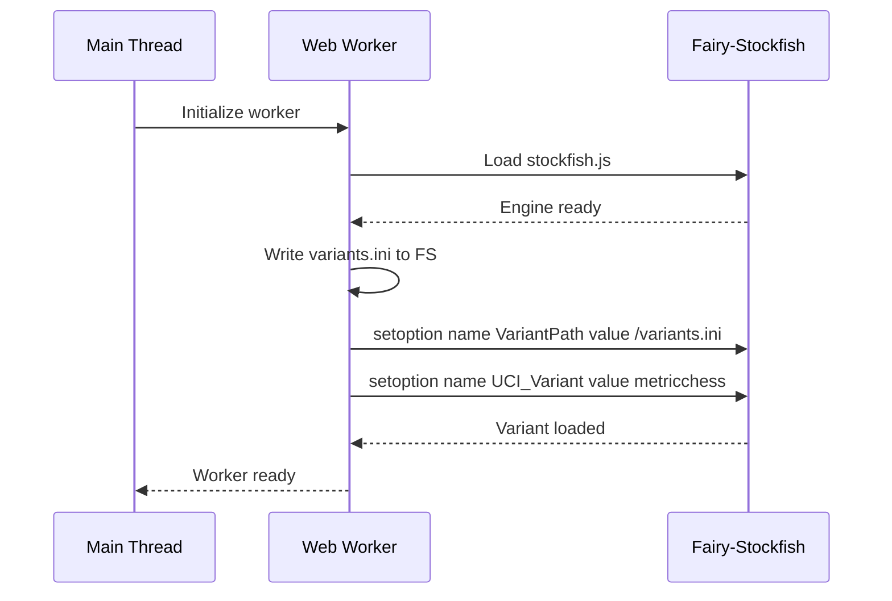
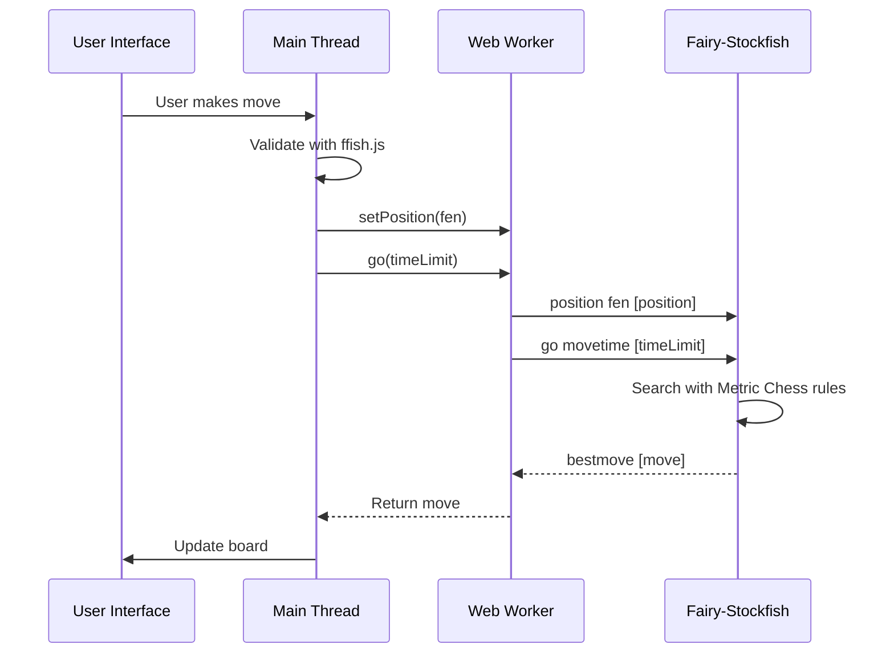

# Metric Chess Variant Guide

## 📋 Overview

Metric Chess is a 10x10 chess variant that introduces unique pieces and rules while maintaining the core chess experience. This document explains the variant configuration, piece movements, and how this information is passed to the Fairy-Stockfish engine.

## 🏰 Board Layout

### 10x10 Board Structure

```board
  a b c d e f g h i j
10 T R N B Q K B N R T  [White]
9  P P P P P P P P P P
8  . . . . . . . . . .
7  . . . . . . . . . .
6  . . . . . . . . . .
5  . . . . . . . . . .
4  . . . . . . . . . .
3  . . . . . . . . . .
2  p p p p p p p p p p  [Black]
1  t r n b q k b n r t
```

**Key Differences from Standard Chess:**

- 10 files (a-j) instead of 8 (a-h)
- 10 ranks (1-10) instead of 8 (1-8)
- Additional trebuchet pieces (T/t) on the corners
- All other pieces follow standard chess rules

## 🏹 Unique Pieces

### Trebuchet (T/t)

The trebuchet is the signature piece of Metric Chess, with devastating jumping capabilities.

**Movement Rules:**

- **Jumping Piece**: Moves exactly Chebyshev distance 3
- **Capture**: Same as movement (can capture by jumping)
- **Value**: More powerful than a queen (10 points vs 9)

**Chebyshev Distance Explanation:**

- Chebyshev distance = max(|Δx|, |Δy|)
- For trebuchets: max(|Δx|, |Δy|) = 3

**Valid Trebuchet Moves:**

```list
From position (5,5), trebuchet can move to:
- (2,5), (8,5), (5,2), (5,8)  // Orthogonal jumps (3,0)
- (2,2), (8,8), (2,8), (8,2)  // Diagonal jumps (3,3)
- (2,4), (8,4), (2,6), (8,6)  // (3,1) jumps
- (4,2), (6,2), (4,8), (6,8)  // (1,3) jumps
- (2,3), (8,3), (2,7), (8,7)  // (3,2) jumps
- (3,2), (7,2), (3,8), (7,8)  // (2,3) jumps
```

**Visual Representation:**

```board
       a b c d e f g h i j
     +---------------------+
  10 | . . . . . . . . . . |
  9  | . . . . . . . . . . |
  8  | . X . X . X . X . X |
  7  | . . . . . . . . . . |
  6  | X . X . X . X . X . |
  5  | . . . . T . . . . . |
  4  | X . X . X . X . X . |
  3  | . . . . . . . . . . |
  2  | . X . X . X . X . X |
  1  | . . . . . . . . . . |
     +---------------------+
```

**X** = Valid trebuchet moves from position e5

### Heir Kings (K/k)

Metric Chess features heir kings with special inheritance rules:

**Heir King Rules:**

- **Standard Movement**: Same as regular kings (one square in any direction)
- **Castling**: Available with rooks under specific conditions
- **Inheritance**: When a king is captured, an heir can be promoted

**Castling Rules:**

- Kingside: King moves from e1 to g1, rook from j1 to h1
- Queenside: King moves from e1 to c1, rook from a1 to b1
- Same conditions as standard chess (no pieces between, no check, etc.)

## 🔧 Variant Configuration

### Fairy-Stockfish Variant Definition

The variant is defined using Fairy-Stockfish's INI format and passed to the engine:

```ini
[metricchess:chess]
maxRank = 10
maxFile = 10
startFen = trnbqkbnrt/pppppppppp/10/10/10/10/10/10/PPPPPPPPPP/TRNBQKBNRT w KQkq - 0 1
pieceToCharTable = PNBRQ..............Kpnbrq..............k.......T.......t
pocketSize = 0
promotionRank = 10
promotionPieceTypes = qrbnkt
doubleStep = true
doubleStepRank = 2
doubleStepRankMin = 2
castling = true
castlingKingsideFile = h
castlingQueensideFile = c
# Trebuchet: leaper that moves exactly distance 3 (Chebyshev metric)
customPiece1 = t:m(3,0)m(0,3)m(3,1)m(1,3)m(3,2)m(2,3)m(3,3)
```

### Configuration Breakdown

**Board Dimensions:**

```ini
maxRank = 10      # 10 ranks (1-10)
maxFile = 10      # 10 files (a-j)
```

**Starting Position:**

```ini
startFen = trnbqkbnrt/pppppppppp/10/10/10/10/10/10/PPPPPPPPPP/TRNBQKBNRT w KQkq - 0 1
```

**Piece Character Mapping:**

```ini
pieceToCharTable = PNBRQ..............Kpnbrq..............k.......T.......t
```

This maps internal piece codes to FEN characters. The trebuchet (T/t) is at the end.

**Pawn Rules:**

```ini
promotionRank = 10      # Pawns promote when reaching rank 10
doubleStep = true       # Pawns can move 2 squares from starting rank
doubleStepRank = 2      # White pawns start on rank 2
doubleStepRankMin = 2   # Black pawns start on rank 9 (10 - 2 + 1)
```

**Castling Configuration:**

```ini
castling = true
castlingKingsideFile = h    # Kingside rook on file h (9th file)
castlingQueensideFile = c    # Queenside rook on file c (3rd file)
```

**Trebuchet Definition:**

```ini
customPiece1 = t:m(3,0)m(0,3)m(3,1)m(1,3)m(3,2)m(2,3)m(3,3)
```

This uses Betza notation to define the trebuchet's movement:

- `t:` - Piece identifier (trebuchet)
- `m(3,0)` - Move 3 files, 0 ranks (orthogonal)
- `m(0,3)` - Move 0 files, 3 ranks (orthogonal)
- `m(3,1)` - Move 3 files, 1 rank
- `m(1,3)` - Move 1 file, 3 ranks
- `m(3,2)` - Move 3 files, 2 ranks
- `m(2,3)` - Move 2 files, 3 ranks
- `m(3,3)` - Move 3 files, 3 ranks (diagonal)

## 📦 Passing Variant Information to Engine

### Worker Initialization

The variant configuration is passed to the worker during initialization:

```javascript
// From metric-stockfish-worker.js
const METRIC_CHESS_VARIANT_INI = `
[metricchess:chess]
maxRank = 10
maxFile = 10
startFen = trnbqkbnrt/pppppppppp/10/10/10/10/10/10/PPPPPPPPPP/TRNBQKBNRT w KQkq - 0 1
pieceToCharTable = PNBRQ..............Kpnbrq..............k.......T.......t
pocketSize = 0
promotionRank = 10
promotionPieceTypes = qrbnkt
doubleStep = true
doubleStepRank = 2
doubleStepRankMin = 2
castling = true
castlingKingsideFile = h
castlingQueensideFile = c
customPiece1 = t:m(3,0)m(0,3)m(3,1)m(1,3)m(3,2)m(2,3)m(3,3)
`;

// Write to virtual filesystem
engine.FS.writeFile('/variants.ini', METRIC_CHESS_VARIANT_INI);

// Configure engine to use our variant
sendEngineCommand('setoption name VariantPath value /variants.ini');
sendEngineCommand('setoption name UCI_Variant value metricchess');
```

### Main Thread Configuration

The main thread also loads the variant for ffish.js:

```javascript
// From stockfish-integration.js
loadMetricChessVariant() {
    const metricChessConfig = `
[metricchess:chess]
maxRank = 10
maxFile = 10
startFen = trnbqkbnrt/pppppppppp/10/10/10/10/10/10/PPPPPPPPPP/TRNBQKBNRT w KQkq - 0 1
pieceToCharTable = PNBRQ..............Kpnbrq..............k.......T.......t
pocketSize = 0
promotionRank = 10
promotionPieceTypes = qrbnkt
doubleStep = true
doubleStepRank = 2
doubleStepRankMin = 2
castling = true
castlingKingsideFile = h
castlingQueensideFile = c
customPiece1 = t:m(3,0)m(0,3)m(3,1)m(1,3)m(3,2)m(2,3)m(3,3)
`;

    this.ffish.loadVariantConfig(metricChessConfig);
}
```

## 🎯 Piece Movement Details

### Standard Pieces

All standard chess pieces move according to FIDE rules:

**Pawn (P/p):**

- Move forward 1 square
- Double move from starting rank (rank 2 for white, rank 9 for black)
- Capture diagonally forward
- Promote on rank 10 to Q, R, B, N, K, or T

**Rook (R/r):**

- Orthogonal movement (any number of squares)
- Participates in castling

**Knight (N/n):**

- L-shaped movement (2 squares in one direction, 1 square perpendicular)
- Can jump over other pieces

**Bishop (B/b):**

- Diagonal movement (any number of squares)

**Queen (Q/q):**

- Combines rook and bishop movement
- Most powerful standard piece (9 points)

**King (K/k):**

- Move 1 square in any direction
- Castling available under standard conditions
- Cannot move into check

### Trebuchet Movement Analysis

The trebuchet's movement is defined by the Chebyshev distance formula:

```javascript
function isValidTrebuchetMove(fromFile, fromRank, toFile, toRank) {
    const dx = Math.abs(toFile - fromFile);
    const dy = Math.abs(toRank - fromRank);
    const chebyshevDistance = Math.max(dx, dy);
    
    // Trebuchet moves exactly distance 3
    return chebyshevDistance === 3;
}
```

**Movement Examples:**

```list
From e5 (file 5, rank 5):
- b5 (file 2, rank 5): dx=3, dy=0, max=3 ✅ Valid
- e2 (file 5, rank 2): dx=0, dy=3, max=3 ✅ Valid  
- b2 (file 2, rank 2): dx=3, dy=3, max=3 ✅ Valid
- c4 (file 3, rank 4): dx=2, dy=1, max=2 ❌ Invalid
- h8 (file 8, rank 8): dx=3, dy=3, max=3 ✅ Valid
```

## 🎨 Position Evaluation

### Piece Values

```javascript
const pieceValues = {
    'p': -1, 'n': -3, 'b': -3, 'r': -5, 'q': -9, 't': -10, 'k': 0,  // Black pieces
    'P': 1, 'N': 3, 'B': 3, 'R': 5, 'Q': 9, 'T': 10, 'K': 0       // White pieces
};
```

**Key Observations:**

- Trebuchet (T/t) is valued at 10 points (more than queen at 9)
- This reflects its devastating jumping capability
- Pawns are slightly devalued compared to standard chess

### Positional Factors

The AI evaluation considers several Metric Chess-specific factors:

1. **Trebuchet Pair Bonus**: +5 for two trebuchets, +2 for one
2. **Center Control**: Files 3-6 are considered the "center" on 10x10 board
3. **Attacking Position**: Pieces in enemy territory (ranks 6-10 for white)
4. **King Safety**: Kings in center files (d,e,f) are considered exposed

```javascript
evaluatePosition() {
    let score = 0;
    
    // Count trebuchets
    let whiteTrebuchets = 0, blackTrebuchets = 0;
    
    // If white has 2 trebuchets: score += 5
    // If black has 2 trebuchets: score -= 5
    
    // Center control bonus (files 3-6)
    // Attacking bonuses for pieces in enemy territory
    
    return score;
}
```

## 🔄 Game Flow with Variant

### Initialization Sequence



### Move Processing



## 🧪 Testing Variant Implementation

### Verification Methods

1. **FEN Validation**:

   ```javascript
   // Test that the engine accepts our custom FEN
   const testFen = 'trnbqkbnrt/pppppppppp/10/10/10/10/10/10/PPPPPPPPPP/TRNBQKBNRT w KQkq - 0 1';
   engine.setPosition(testFen);
   ```

2. **Trebuchet Movement**:

   ```javascript
   // Test trebuchet moves from known positions
   const board = new ffish.Board('metricchess', testFen);
   const moves = board.legalMoves();
   
   // Should include moves like a10d7, a10d10, a10b7, etc.
   console.log('Trebuchet moves:', moves.filter(m => m.startsWith('a10')));
   ```

3. **Castling Verification**:

   ```javascript
   // Test that castling works with 10x10 board
   const castlingMoves = moves.filter(m => m === 'e1g1' || m === 'e1c1');
   console.log('Castling available:', castlingMoves.length > 0);
   ```

## 📚 Advanced Variant Topics

### Custom Piece Implementation

The trebuchet is implemented as a custom piece using Fairy-Stockfish's extension mechanism:

```cpp
// In Fairy-Stockfish C++ code
// The customPiece1 definition creates a new piece type
// with the specified movement pattern

// Movement generation for trebuchet:
Bitboard trebuchetAttacks(Square from) {
    Bitboard attacks = 0;
    
    // All squares where max(|dx|, |dy|) = 3
    for (int dx = -3; dx <= 3; dx++) {
        for (int dy = -3; dy <= 3; dy++) {
            if (abs(dx) == 3 || abs(dy) == 3) { // At least one coordinate has distance 3
                Square to = from + dx + dy * 16;
                if (isOk(to)) {
                    attacks |= to;
                }
            }
        }
    }
    
    return attacks;
}
```

### Variant Inheritance

Metric Chess inherits from standard chess and overrides specific rules:

```ini
[metricchess:chess]  # Inherits from standard chess
maxRank = 10         # Override: 10 ranks instead of 8
maxFile = 10         # Override: 10 files instead of 8
customPiece1 = t:... # Override: Add trebuchet piece
```

### Performance Considerations

The 10x10 board and additional pieces impact performance:

- **Search Space**: ~56% larger than standard chess (100 vs 64 squares)
- **Move Generation**: More complex due to trebuchet jumps
- **Evaluation**: Additional piece types require more computation

**Optimization Techniques:**

- Efficient move generation for trebuchets
- Specialized evaluation for 10x10 board
- Caching of common positions

## 📝 Summary

This document provides comprehensive coverage of the Metric Chess variant, including:

- **Board Layout**: 10x10 structure with extended files and ranks
- **Unique Pieces**: Detailed explanation of trebuchet movement and heir kings
- **Variant Configuration**: How the variant is defined and passed to the engine
- **Implementation Details**: Code snippets showing key aspects
- **Game Flow**: How the variant affects move processing
- **Testing**: Methods to verify variant implementation

The Metric Chess variant successfully extends standard chess with innovative pieces while maintaining compatibility with the Fairy-Stockfish engine through its flexible variant system.

## Alternate Analysis

This was created from a conversation with Grok about what Metric Chess is, and how it could be implemented in Fairy-Stockfish. We'll us it to validate everything we've just described.

```configuration
[metricchess:fairy]
; 10x10 board (files a-j, ranks 1-10)
maxFile = 10
maxRank = 10

; Trebuchet (t): jumps **exactly** to the 3rd Chebyshev perimeter (24 squares: max(|dx|,|dy|)=3)
; Betza: j(HCZ(3,3)) = jumping threeleaper(H=(0,3)) + camel(C=(1,3)) + zebra(Z=(2,3)) + (3,3)-leaper
; Covers all 4+8+8+4=24 target squares, ignoring pieces (j=jump). Perfect match!
customPiece1 = t:j(HCZ(3,3))

; Starting FEN: Trebuchets (T/t) in outer corners
startFen = trnbqkbnrt/pppppppppp/10/10/10/10/10/PPPPPPPPPP/TRNBQKBNRT w KQkq - 0 1

; Pawns: always 1 **or** 2 forward (from any rank), no en passant
doubleStep = true
doubleStepRegionWhite = *1 *2 *3 *4 *5 *6 *7 *8 *9
doubleStepRegionBlack = *2 *3 *4 *5 *6 *7 *8 *9 *10
enPassantRegionWhite =
enPassantRegionBlack =

; Promotion: Q/R/B/N/K/T on last rank; engine auto-forbids K if adjacent to opp king(s)
promotionPieceTypes = q r b n k t
promotionRegionWhite = *10
promotionRegionBlack = *1
mandatoryPawnPromotion = false

; Royals: Multiple kings OK; extras are pseudo-royals (no check on them). Last king becomes royal.
; Auto-forbids moving/promoting any king adjacent to opp king(s). Own kings can adj OK.
extinctionPieceTypes = k
extinctionValue = loss
extinctionPseudoRoyal = true
dupleCheck = true  ; Protects all kings from check (conservative; AI adapts)

; Castling: Kingside/Queenside with rooks (R/r) **or** trebuchets (T/t)
castling = true
castlingRookPieces = r t

; ~10-move no-capture approx (20-ply, resets on pawn/capture; your app overrides exactly)
nMoveRule = 20
nMoveRuleTypes = p
nFoldValue = draw
```
