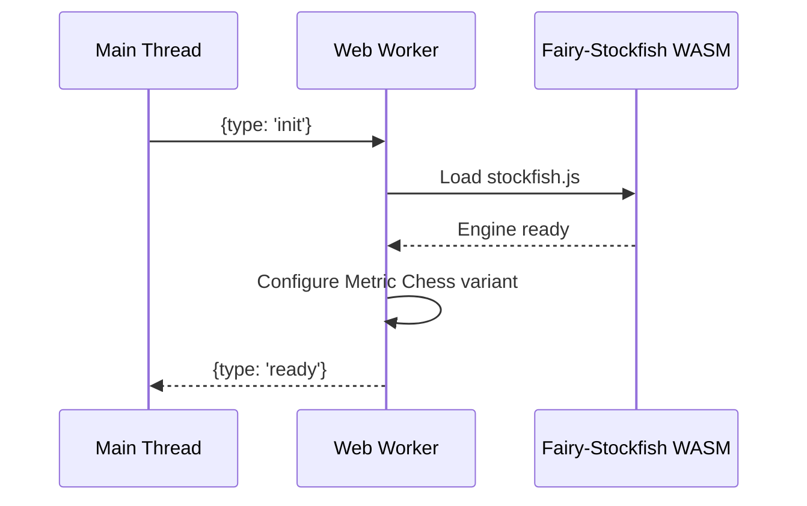
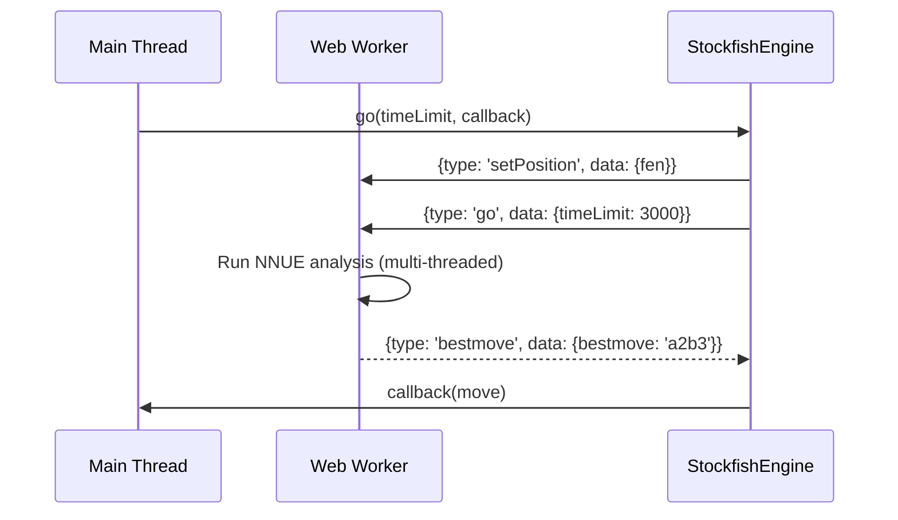

# Web Workers Architecture

## Overview

Metric Chess implements a sophisticated web worker architecture to provide non-blocking AI analysis using the full Fairy-Stockfish engine with NNUE evaluation. This ensures the UI remains responsive during complex chess calculations while leveraging multi-threading for optimal performance.

## Architecture Components

### 1. StockfishEngine (`js/stockfish/stockfish-integration.js`)

The main coordinator class that manages both worker-based NNUE search and fallback mechanisms.

```javascript
class StockfishEngine {
    constructor() {
        this.ffish = null;
        this.board = null;
        this.worker = null;
        this.useWorker = true; // Default to worker for NNUE search
        this.init();
    }
}
```

**Key Responsibilities:**

- Initialize both worker and ffish.js components
- Coordinate between NNUE search (worker) and board manipulation (ffish.js)
- Provide unified API for AI move generation
- Handle fallback scenarios

### 2. StockfishWorker Wrapper (`js/stockfish/stockfish-worker-wrapper.js`)

Main thread interface for worker communication, providing a clean API abstraction.

```javascript
class StockfishWorker {
    constructor() {
        this.worker = new Worker('/js/stockfish/metric-stockfish-worker.js');
        this.isReady = false;
        this.requestId = 0;
        this.pendingRequests = {};
    }
}
```

**Features:**

- Message passing abstraction
- Request/response correlation with IDs
- Error handling and recovery
- UCI move format parsing for 10x10 boards

### 3. Metric Stockfish Worker (`js/stockfish/metric-stockfish-worker.js`)

The dedicated worker that runs the Fairy-Stockfish WASM engine.

```javascript
// Worker state
let engine = null;
let isReady = false;

// Message handlers
self.onmessage = function(e) {
    switch (message.type) {
        case 'init': handleInit(message); break;
        case 'setPosition': handleSetPosition(message); break;
        case 'go': handleGo(message); break;
    }
};
```

## Message Protocol

### Initialization Sequence



### AI Move Request Flow



## Message Types

### Outgoing Messages (Main → Worker)

```typescript
interface WorkerMessage {
    type: 'init' | 'setPosition' | 'go' | 'stop' | 'quit';
    data?: {
        fen?: string;
        timeLimit?: number;
    };
    id: string; // Request correlation
}
```

### Incoming Messages (Worker → Main)

```typescript
interface WorkerResponse {
    type: 'ready' | 'bestmove' | 'info' | 'error';
    data?: any;
    id: string;
}
```

## Error Handling and Fallback

### Worker Failure Scenarios

1. **Initialization Failure**
   - WASM load errors
   - SharedArrayBuffer not supported
   - Network issues loading stockfish.js

2. **Runtime Errors**
   - Engine crashes during analysis
   - Invalid FEN positions
   - Memory allocation failures

### Fallback Strategy

```javascript
// In StockfishEngine.go()
if (this.useWorker && this.workerReady) {
    // Try worker-based NNUE search
    this.worker.go(timeLimit, (move) => {
        if (move && !isNaN(move.fromFile)) {
            callback(move); // Success
        } else {
            this.fallbackSearch(timeLimit, callback); // Fallback
        }
    });
} else {
    // Direct fallback to minimax
    this.fallbackSearch(timeLimit, callback);
}
```

## Performance Considerations

### Thread Management

- **CPU Utilization**: Uses 75% of available cores (max 8 threads)
- **Thread Detection**: `navigator.hardwareConcurrency`
- **SharedArrayBuffer Check**: `typeof SharedArrayBuffer !== 'undefined'`

```javascript
const hasSharedArrayBuffer = typeof SharedArrayBuffer !== 'undefined';
const cpuCores = navigator.hardwareConcurrency || 2;
const targetThreads = Math.max(1, Math.floor(cpuCores * 0.75));
const threads = hasSharedArrayBuffer ? Math.min(targetThreads, 8) : 1;
```

### Memory Management

- **Worker Isolation**: Prevents memory leaks in main thread
- **Cleanup**: Proper worker termination on quit
- **Buffer Management**: UCI output buffering for move parsing

## Development and Debugging

### Logging Strategy

```javascript
// Worker-side logging
console.log('Worker: Loading Fairy-Stockfish WASM engine...');

// Main-thread logging
console.log('Main: Worker returned move:', move);
```

### Testing Worker Functionality

Use `test-worker.html` for isolated worker testing:

```html
<!-- test-worker.html -->
<script>
const worker = new Worker('/js/stockfish/metric-stockfish-worker.js');
worker.onmessage = (e) => console.log('Worker response:', e.data);
worker.postMessage({type: 'init'});
</script>
```

## Integration with Main Application

### UI Feedback During Analysis

```javascript
// Show thinking indicator
function showAIThinking() {
    const spinner = document.getElementById('ai-spinner');
    spinner.style.display = 'block';
}

// Called when worker starts analysis
stockfishEngine.go(3000, (move) => {
    hideAIThinking();
    // Process the move
});
```

### Move Validation

Worker moves are validated using ffish.js before acceptance:

```javascript
this.worker.go(timeLimit, (move) => {
    const uciMove = this.moveToUCI(move);
    const legalMoves = this.getLegalMoves();

    if (legalMoves.includes(uciMove)) {
        callback(move); // Valid move
    } else {
        console.warn('Worker move invalid, using fallback');
        this.fallbackSearch(timeLimit, callback);
    }
});
```

This architecture provides professional-level chess analysis while maintaining excellent user experience through non-blocking operation and robust error handling.
