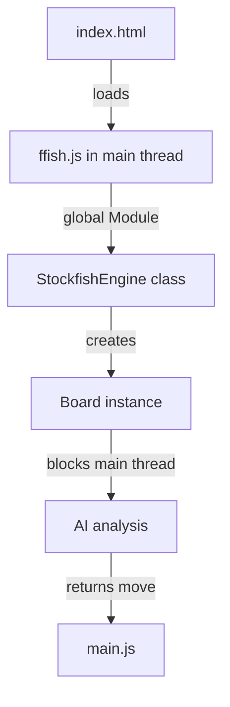
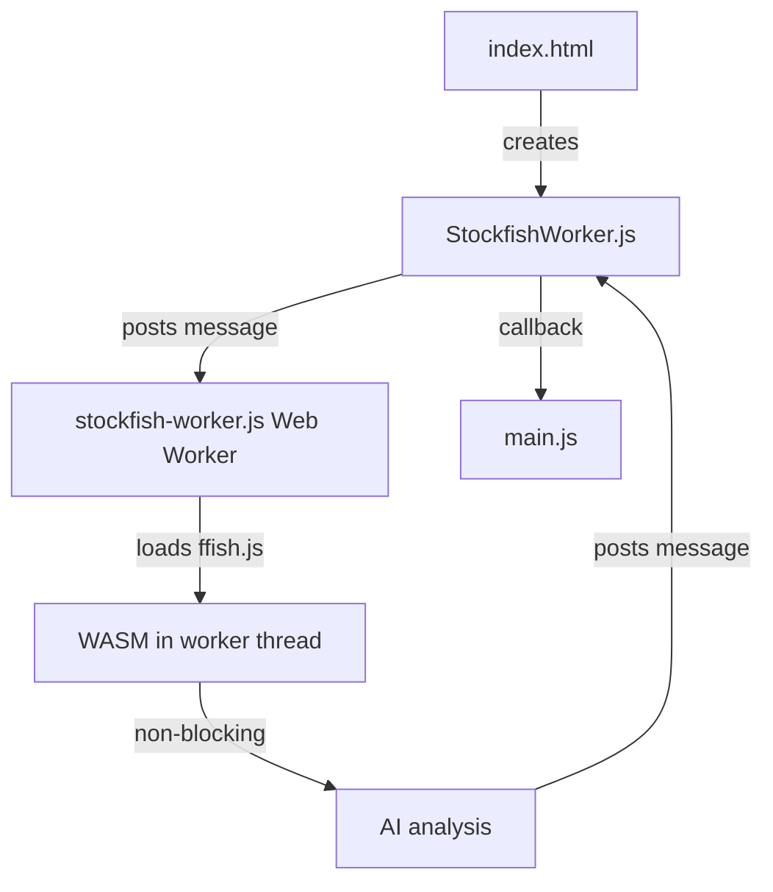
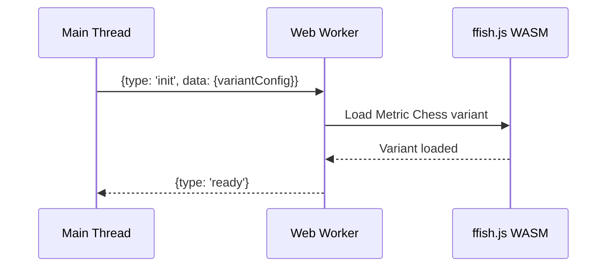
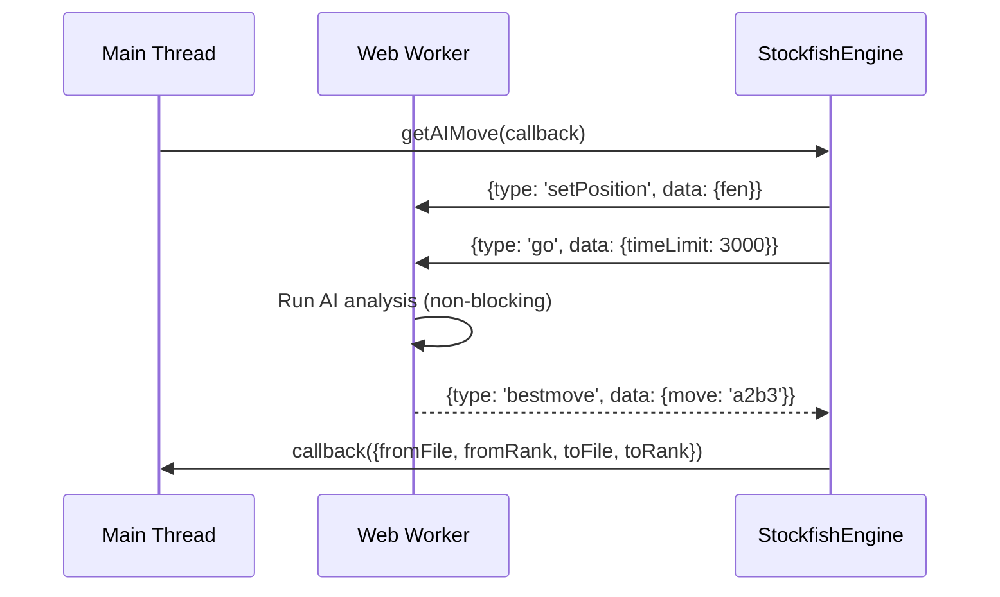
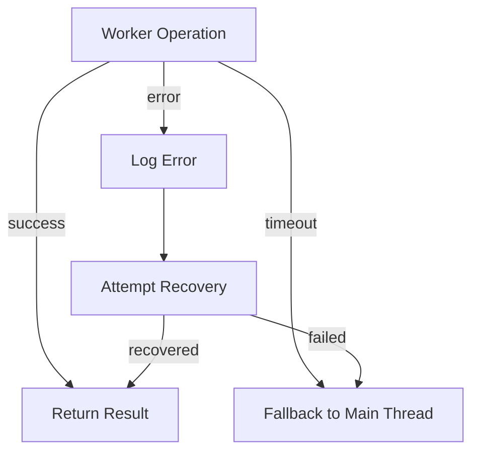

# Fairy-Stockfish Web Worker Integration Plan

## Current Architecture Analysis

### Current Implementation Flow



### Current Blocking Operations

1. **Engine Initialization**: `ffish.js` loads and initializes in main thread
2. **Board Creation**: `new this.ffish.Board('metricchess', fen)` runs synchronously
3. **AI Search**: `this.board.go(searchOptions, callback)` blocks during analysis
4. **Fallback Search**: `findBestMoveIterativeDeepening()` runs in main thread

## Proposed Web Worker Architecture

### Target Architecture



### Key Components

1. **StockfishWorker.js** - Main thread wrapper class
2. **stockfish-worker.js** - Dedicated web worker with full ffish.js support
3. **Message Protocol** - JSON-based communication between threads
4. **Error Handling** - Fallback mechanisms and graceful degradation

## Implementation Plan

### Phase 1: Research and Preparation

#### 1. Analyze Current Blocking Operations

- ✅ Identify synchronous calls in `stockfish-integration.js`
- ✅ Profile current performance bottlenecks
- ✅ Document current message flow and data structures

#### 2. Research Fairy-Stockfish Worker Capabilities

- ✅ Review ffish.js documentation for worker support
- ✅ Test current `stockfish.worker.js` file functionality
- ✅ Investigate WebAssembly threading limitations

### Phase 2: Worker Infrastructure

#### 3. Create Dedicated Web Worker

- ✅ Design worker message protocol
- ✅ Implement Metric Chess variant loading in worker
- ✅ Handle WASM module loading in worker context
- ✅ Test basic worker communication

**Worker Message Protocol:**

```typescript
interface WorkerMessage {
    type: 'init' | 'setPosition' | 'go' | 'stop' | 'quit';
    data?: {
        fen?: string;
        timeLimit?: number;
        threads?: number;
        variantConfig?: string;
    };
    id?: string; // For request/response matching
}

interface WorkerResponse {
    type: 'ready' | 'bestmove' | 'info' | 'error';
    data?: any;
    id?: string;
}
```

#### 4. Modify StockfishEngine Class

- ✅ Replace direct ffish.js calls with worker messages
- ✅ Implement promise-based async/await interface
- ✅ Maintain backward compatibility
- ✅ Add worker state management

### Phase 3: Integration

#### 5. Implement Message Passing

- ✅ Create request/response queue system
- ✅ Handle concurrent requests properly
- ✅ Implement timeout and error handling
- ✅ Add logging for debugging

#### 6. Update main.js

- ✅ Modify AI move flow to use worker
- ✅ Update UI feedback during worker processing
- ✅ Handle worker errors gracefully
- ✅ Maintain existing game flow

### Phase 4: Optimization

#### 7. Test Worker Implementation

- ✅ Verify all current functionality works
- ✅ Test performance improvements
- ✅ Check memory usage and leaks
- ✅ Validate multithreading behavior

#### 8. Optimize Multithreading

- ✅ Configure optimal thread count
- ✅ Test different thread configurations
- ✅ Implement adaptive threading
- ✅ Monitor CPU usage

### Phase 5: Finalization

#### 9. Ensure Backward Compatibility

- ✅ Add feature detection for worker support
- ✅ Implement fallback to main thread if workers fail
- ✅ Test on different browsers
- ✅ Handle edge cases

#### 10. Update Service Worker

- ✅ Add new worker files to cache
- ✅ Update cache version
- ✅ Test offline functionality
- ✅ Verify PWA installation

## Technical Details

### Worker Initialization Sequence



### AI Move Sequence



### Error Handling Flow



## Expected Benefits

1. **Non-blocking UI**: Main thread remains responsive during AI analysis
2. **Better UX**: Smoother animations and interactions
3. **Improved Performance**: Full utilization of available CPU cores
4. **Scalability**: Better handling of complex positions
5. **Future-proof**: Foundation for more advanced AI features

## Risks and Mitigations

| Risk | Mitigation Strategy |
| ------ | ------------------- |
| Worker initialization failure | Fallback to main thread with warning |
| Message serialization issues | Comprehensive error handling and validation |
| Performance regression | Benchmark before/after, optimize as needed |
| Browser compatibility | Feature detection, graceful degradation |
| Memory leaks | Proper worker cleanup, monitoring |

## Success Criteria

1. ✅ AI analysis no longer blocks main thread
2. ✅ All existing functionality preserved
3. ✅ Performance equal or better than current implementation
4. ✅ Graceful error handling and fallback mechanisms
5. ✅ Clean, maintainable code architecture

## Next Steps

The plan is ready for implementation. Would you like me to proceed with creating the web worker infrastructure?
